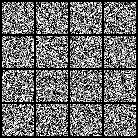
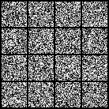

# DIT_RF - Minimal Implementation of Scalable Rectified Flow Transformers

  
  

> Left is the naive RF, right is the logit-normal time-sampling RF. Both are trained on MNIST.

This repository contains a minimal implementation of the rectified flow models. I've taken [SD3](https://arxiv.org/abs/2403.03206) approach of training along with [LLaMA-DiT](https://github.com/Alpha-VLLM/LLaMA2-Accessory) architecture. [Unlike my previous repo](https://github.com/cloneofsimo/minDiffusion) this time I've decided to split the file into 2: The model implementation and actual code, but you don't have to look at the model code.

Everything is still self-contained, minimal, and hopefully easy to hack. There is nothing complicated goin on if you understood the math.

# 1. *Simple* Rectified Flow, for beginners

Install torch, pil, torchvision